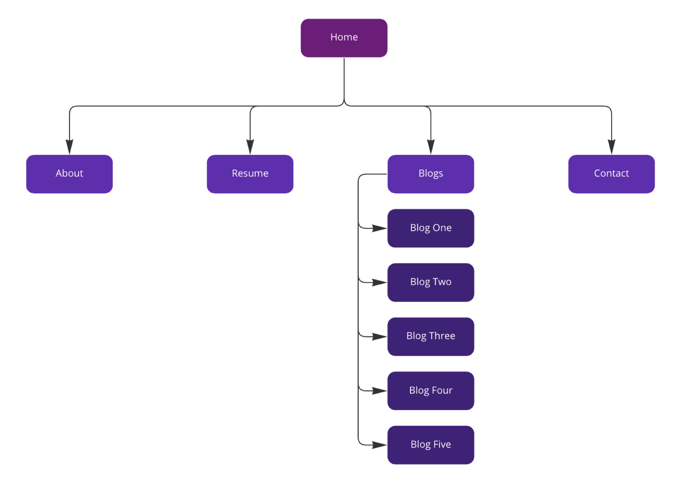
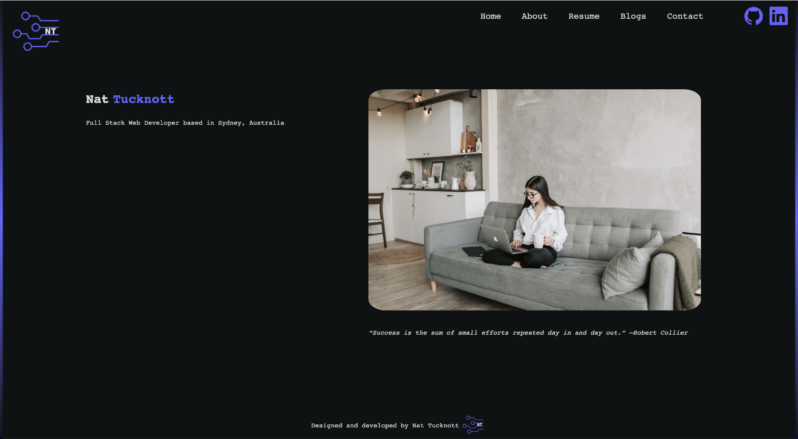
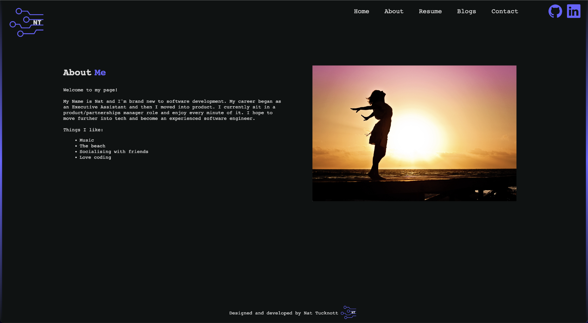
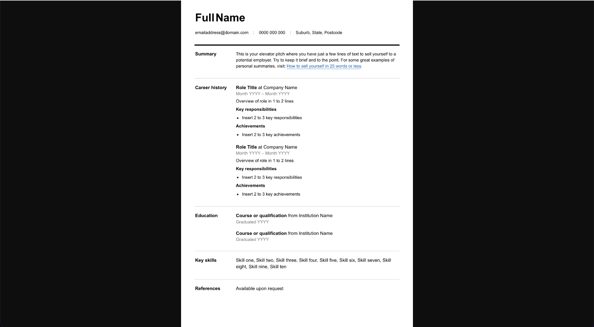
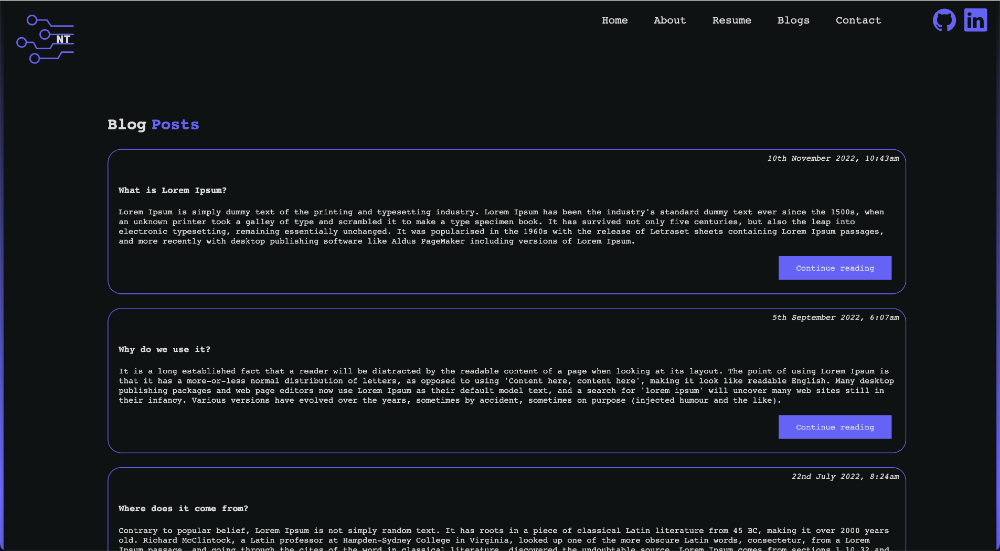
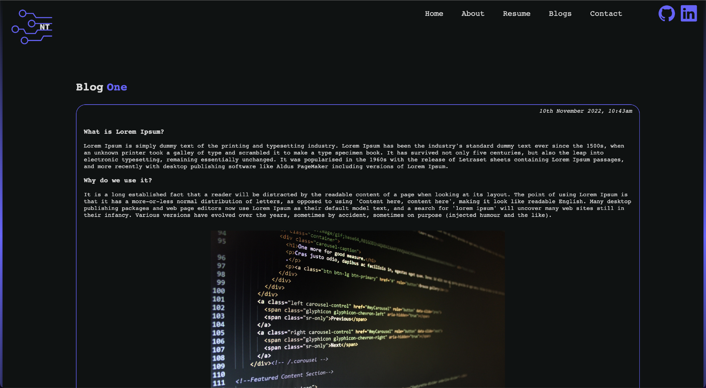

# WD-STD-2022-02- T1A1

Welcome to my portfolio website!

**Website Link:** https://profound-cactus-406f29.netlify.app

**GitHub Repo:** https://github.com/Tucky28/t1a1portfolio.git

**Presentation:** https://docs.google.com/presentation/d/1DQGamqJ1ET5FCBC2UAQi3Z9oXAVSZ3znyQDM0TraTHw/edit?usp=sharing

**Presentation Video:**:https://vimeo.com/770140600

## Purpose

The purpose is to provide and online developer portfolio representing who I am, my interests and skills, how to contact me and to showcase any work I have.

## Functionality/Features

- Responsive layout for iPhone XR, Ipad Air and 1280px screen (laptop and above)
- Navigation menu with hover effect
- Personalised logo
- About me page with interests and employment details
- Contact me page with a form for users to enter in details including phone number and email details
- GitHub and LinkedIn icons linking to the websites
- Blog listing page wit five blogs and a button on each linking to a seperate page where users can read the full blog
- Resume menu item which links to a resume on a seperate tab
- Modern design with gradient borders across the pages

## Sitemap

## Screenshots

## Target Audience

The target audience for the portfolio website is employees or recruiters trying to engage a dev and/or IT professional.

## Tech Stack

To create the website

- Vs code - HTML - Css using SASS/SCSS
  Cloud-based repository
- Github
  To deploy website
- Netlify
